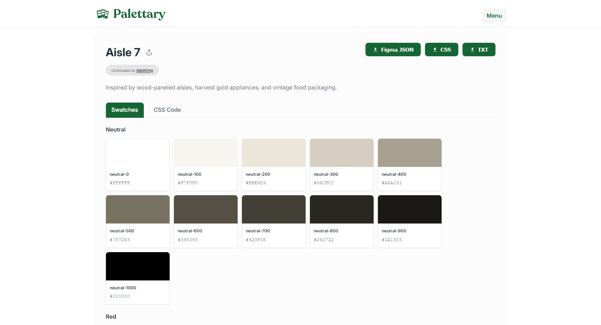
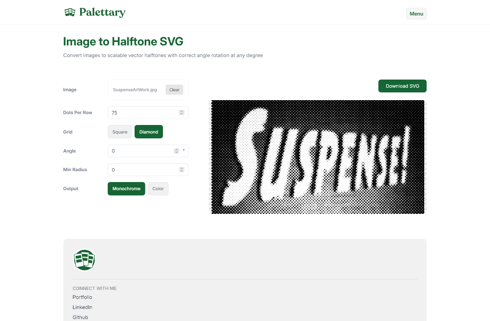
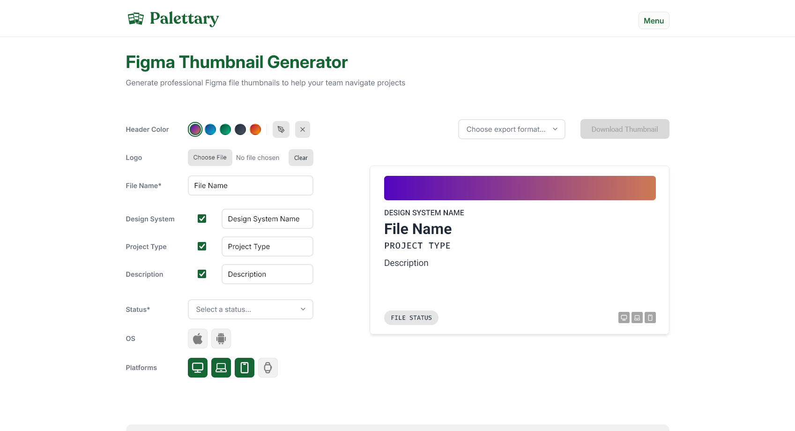
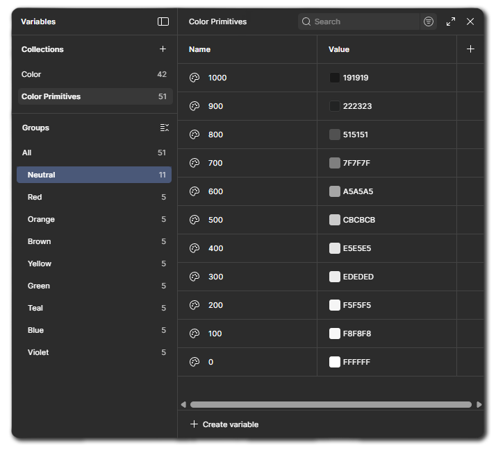

<div align="center">
<a href="https://datatimp.github.io/palettary" target="_blank">
  
</a>
</div>

<br />

---

<div align="center">
<br />
 <p>
    <strong>Helpful Design Tools</strong><br />
    No accounts. No subscriptions.
  </p>

  
 
 

<br />
</div>

<div align="center">

</div>

## Table of Contents
1. [Available Apps](#available-apps)
2. [What are color primitives?](#what-are-color-primitives)
3. [Creating accurate halftones](#creating-accurate-halftones)
4. [Why generate thumbnails?](#why-generate-thumbnails)
5. [Contributions](#contributions)

<br>

## Available Apps

<div align="center">

  <h3>🎨 Color Primitives</h3>
  <p>Browse, preview, and export curated color palette collections directly to Figma. Perfect for setting up your design system's foundation.</p>
  
  
  <br/>
  
  <a href="https://datatimp.github.io/palettary">
    
  </a>

  <div align="left" style="max-width: 400px;">
    <ul>
      <li>Browse palettes with evocative names</li>
      <li>One-click hex copy</li>
      <li>Export to Figma JSON, TXT, or MD</li>
    </ul>
  </div>

  <br/><hr/><br/>

  <h3>◎ Halftone SVG</h3>
  <p>Convert any image to a scalable monochrome vector halftone. </p>

  
  <br/>

  <a href="https://datatimp.github.io/palettary/halftone.html">
    
  </a>

  <div align="left" style="max-width: 400px;">
    <ul>
      <li>Monochrome, Flattened Color, and CMYK Separation modes</li>
      <li>Square and Diamond grid options</li>
      <li>Correct rotation coverage at any screen angle</li>
      <li>Export as SVG</li>
    </ul>
  </div>

  <br/><hr/><br/>

  <h3>🖼️ Thumbnail Generator</h3>
  <p>Create professional file cover thumbnails for your Figma projects in seconds. Keep your team organized with consistent visuals.</p>
  
  
  <br/>

  <a href="https://datatimp.github.io/palettary/figthumb.html">
    
  </a>

  <div align="left" style="max-width: 400px;">
    <ul>
      <li>Customizable project status & types</li>
      <li>Toggle platform icons (iOS, Android, etc.)</li>
      <li>Export as PNG or SVG</li>
    </ul>
  </div>

</div>

<br />

## What are Color Primitives?

Color primitives are the **raw color values** in your design system (e.g., `blue-500: #2563EB`). They describe what a color *is*.

<br />

<div align="center">

<figure>
  
  <br />
  <figcaption align="center"><i>Figure 1: Figma variables panel showing color primitives.</i></figcaption>
</figure>

</div>

<br />
<br />

**Semantic tokens**, on the other hand, describe a color's *purpose* (e.g., `color-text-primary`). By referencing primitives, you create a flexible abstraction layer.

```
Primitive:        blue-600 → #2563EB
                      ↑
Semantic token:   color-link-default → blue-600
```

1.  **Start with Primitives**: Use a palette from Palettary as your foundation.
2.  **Mix & Match**: Once ported into Figma, alter colors as you see fit.
3.  **Create Semantics**: Create semantic tokens and map them to the corresponding primitives. 

This [article](https://medium.com/@tarun_design00/color-system-color-theory-primitives-semantics-tokens-567f64368d30) on Medium is a terrific resource from which to learn more. 

<br />

## Creating accurate halftones

A halftone converts a continuous-tone image into a pattern of discrete dots. Varying dot size creates the illusion of shading — large dots in dark areas, small dots in highlights. Halftones are the foundation of offset printing, risograph, and screen printing, and remain a popular aesthetic in digital design.

**CMYK separation.** Process color printing uses four ink layers — Cyan, Magenta, Yellow, and Key (Black) — each screened at a different angle to prevent moiré patterns. CMYK Separation mode generates a separate SVG per channel at its own screen angle with `mix-blend-mode: multiply` applied. Standard angle presets (US, EU, and six alternates) are included, and individual channels can be disabled for spot color workflows like risograph (CMY only) or duotone.

**Proper rotation.** Palettary's tool loops the grid in rotated coordinate space over the full image diagonal before transforming back to image coordinates, then uses a `clipPath` to trim to bounds. This means any angle — 0°, 15°, 45°, 75° — produces complete, edge-to-edge coverage.

**Grid types.** Square grid places dots at equal horizontal and vertical intervals. Diamond grid halves the vertical spacing and offsets every odd row by half a cell width, producing twice the row density in the same vertical space. This can be a handy alternative to a square grid for some black and white images. Square grids are preferred for color.

<br />

## Why generate thumbnails?

Figma's file browser can quickly become cluttered. Thumbnails give your team a visual system to scan and identify files instantly.

With Palettary's thumbnail generator, you can:

- **See status at a glance**: Know immediately if a file is `WIP`, `In Review`, or `Ready for Dev` without opening it.
- **Quickly know categorization**: Distinguish between `Design`, `Prototypes`, and `Specs` with color-coded covers.
- **Understand project context**: Ensure every file clearly states which project or design system it belongs to.


<br />

## Contributing
I want these tools to be helpful to as many as possible. If you'd like to submit a palette, or an idea, use [this Google Form](https://forms.gle/xqpEMTbqkQMFyp1v6). For bug reports, submit to this repository.